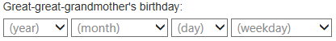

# aboutWhen

This is a jQuery plugin for accepting partial or approximate dates.

Calendar controls and their variants are great if you want your users to pick one valid date precisely, but in the case where a user may have incomplete information that you want to capture (for example, "I think it was in May of 1985" or "on a Saturday last month"), you need a control that can accept partial information.

The `aboutWhen` control creates a separate HTML `select` element for year, month, day, and day of the week, and balances input between them to try to ensure that the resulting information is consistent.

### Usage

1. Include **jquery-aboutWhen.min.css** in the `<head>` element of your HTML page:

        <link rel="stylesheet" type="text/css" href="./css/jquery-aboutWhen.css" />

    Or, since this CSS only styles 3 classes and you may want to adjust it for your site, you can just incorporate its content into one of your own CSS files.
 
2. Then, in the `<body>` of your HTML page, place an empty `
` element with its own `id` and a class of `hsh-when`:

        

3. At the end of the HTML body, include the **jquery-aboutWhen.min.js** Javascript file:

        

4. Finally, apply `aboutWhen` to everything of class `hsh-when`:

        

The result is a set of 4 `<select>` elements in your page:

> 

These elements have `name` and `id` attributes created from the `id` of the parent `div` as follows:

    year:    [parent div's id]_y
    month:   [parent div's id]_m
    day:     [parent div's id]_d
    weekday: [parent div's id]_w

Similarly, the corresponding `label` elements have the following `id` attributes:

    year:    [parent div's id]_yL
    month:   [parent div's id]_mL
    day:     [parent div's id]_dL
    weekday: [parent div's id]_wL

When you open one of the select elements (here the weekday one), it looks like something like this:

> 

### Options

You can also call `aboutWhen` with a *settings* or *options* parameter (I prefer "settings" here so as not to confuse them with `select` element options). Below are the possible fields in a *settings* parameter, containing the values that `aboutWhen` uses by default:

    {
      maxY : undefined,   /* If maxY is undefined, the current year is used. */ 
      minY : 1900,
      widths: [ "80px", "120px", "70px", "125px" ],
      text : {
        Nm: [ "(year)", "(month)", "(day)", "(weekday)" ],
        Mo: [ "January", "February", "March",
              "April", "May", "June",
              "July", "August", "September",
              "October", "November", "December" ],
        Wd: [ "Sunday", "Monday", "Tuesday", "Wednesday",
               "Thursday", "Friday", "Saturday" ],
        ns: "(not sure)"
      }
    }
    
Each of the 4 top-level *settings* fields is optional, but any one you include MUST be complete. For example, if you pass in a *settings* parameter containing a `text` field, the `text` field MUST contain a `Nm` array of 4 label names, a `Mo` array of 12 month names, a `Wd` array of 7 weekday names, and an `ns` string for the "not sure" option.

### Feedback?

I'm new to Javascript and jQuery, so I'm pretty sure there are better ways to accomplish a lot of what I'm doing here, and I'd much appreciate any help, corrections or suggestions!

Since it's a pretty simple plugin, I've tried to keep it light-weight. For the future, though, I'm wondering about doing an alternate version that uses [Chosen](http://harvesthq.github.io/chosen/) to make things prettier. Thoughts?

